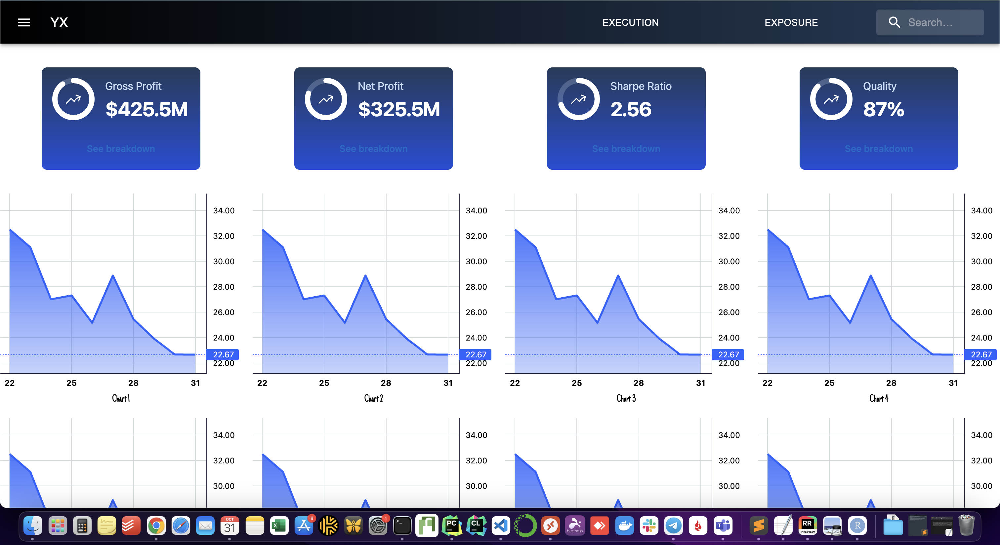
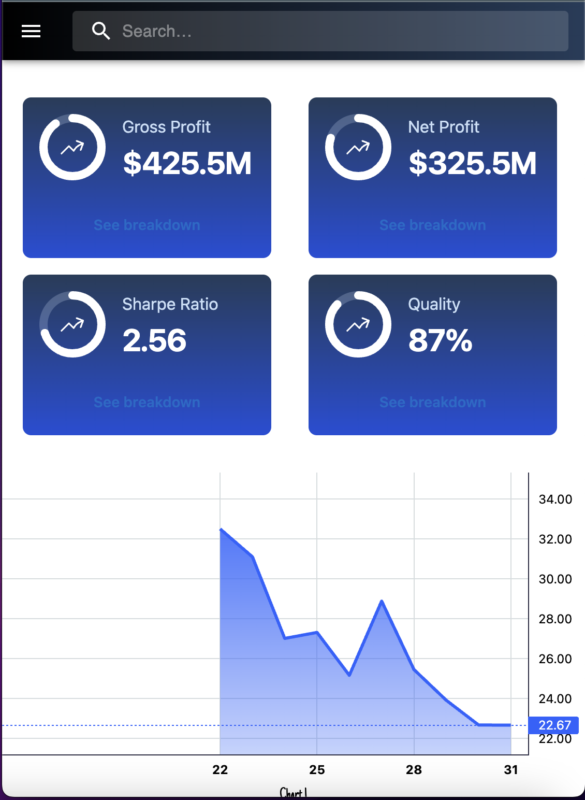

This is a (pointless), but concurrent, parallel + efficient realtime charting web-app.
It is built on Next.js, in a fully responsive grid template, with a (dummy-search) nav.

Workflow is meant to be a sink for realtime events to be pushed to chart components, displaying TV LWC components that update realtime. 
It has 2 demo api's / back-ends,
- Open WS, spins up N websocket servers, based on config.js, and routes messages to next.js ws clients.
    ``` demo_uri = `${host}:${algoConfig[componentAlgoId]} ```
    - this can be a polling workflow, python app polls, sends updates to this node endpoint.
    - this can be a push workflow, rust app sends events realtime to respective ws.
        - could make this a unified ws server + router to ext event source, but that creates a bottleneck.

- GCP PubSub x WS: spins up N websocket servers, subscribes to pubsub, and routes pubsub events to respective ws.


Visualizations:





Pages


Entrypoint Flow

To be clear on the flow:

1.  start multiple WebSocket servers, one for each algorithm, each on its own port. (HERE)
    Port mapping based on config.js -- algo_id: port. 

2.  Clients (in our case, Next components representing charts) 
    connect to the appropriate WebSocket server using the corresponding port 
    (determined by the algorithm they're interested in).

3.  External sources (like some data processing service or another server) send messages to these WebSocket servers. 
    These could be updates related to the algorithm's execution, new data points for the chart, etc.

4.  Upon receiving a message, the WebSocket server broadcasts it to all connected clients for that algorithm.

5.  Each client (React component) processes the received message and updates the chart accordingly.


NOTE: with tick level data, we should consider a different X axis, as time pushes TV LWC to a 'scale' that is nearly infinite width. Should instead just rely up possibly sampling, or pure indexes.

Other options could be NOT TV LWC, something like plotly, with less zoom / scale / transition, but more ability to dig in discretly. 
Highcharts would also be a great option.

This could also subscribe to pubsub, or poll things, etc -- but 'push' is going to be most efficient.

